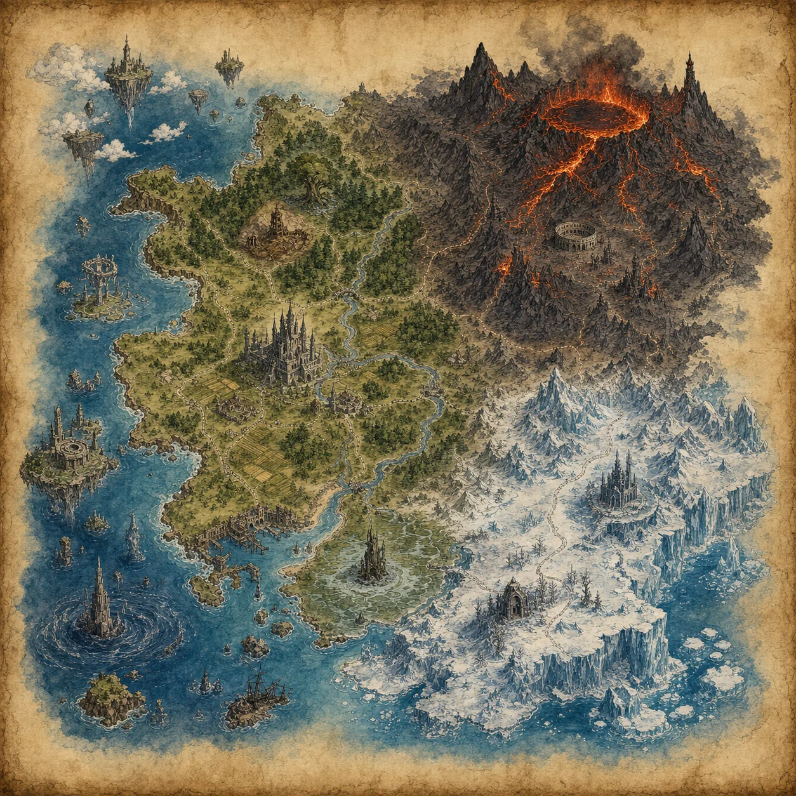
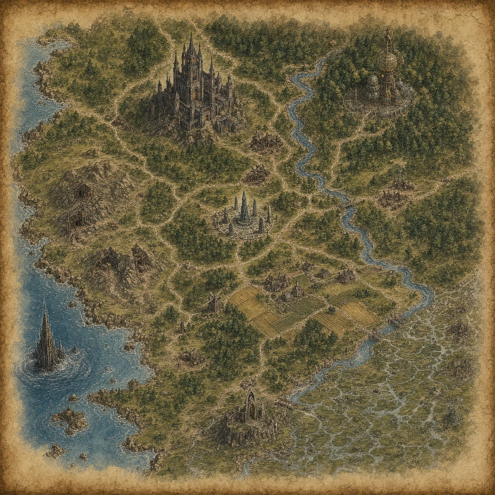
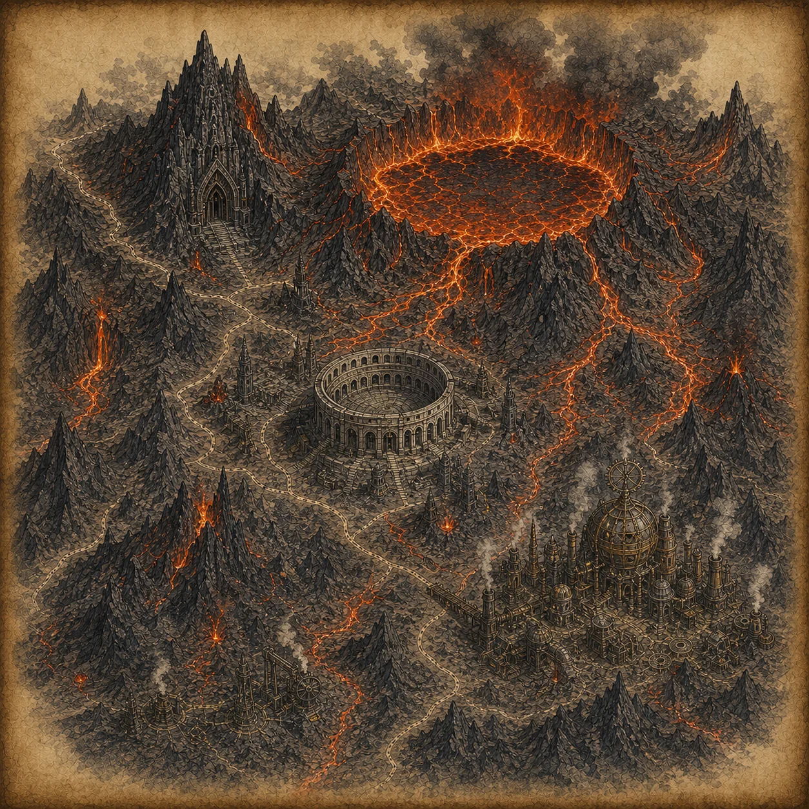
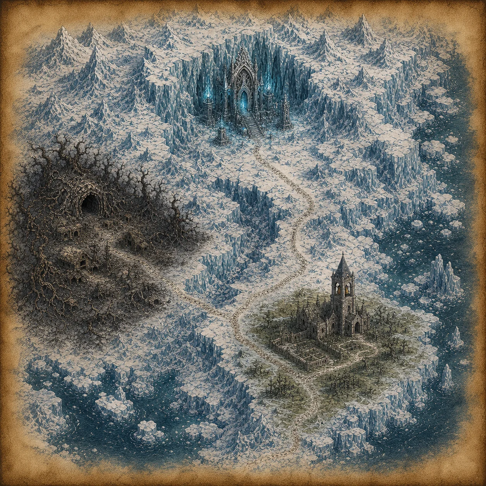
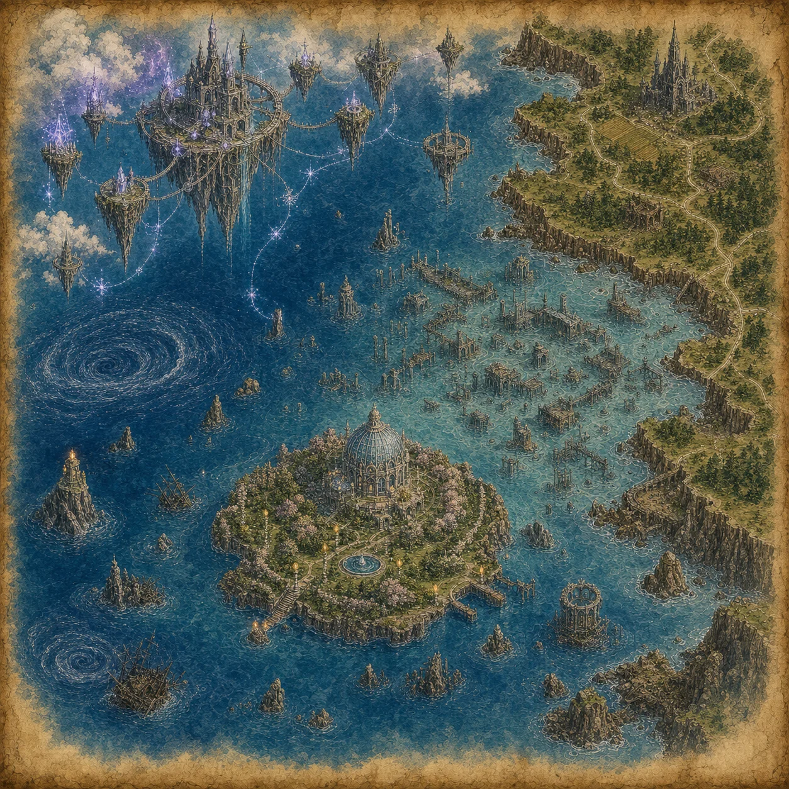
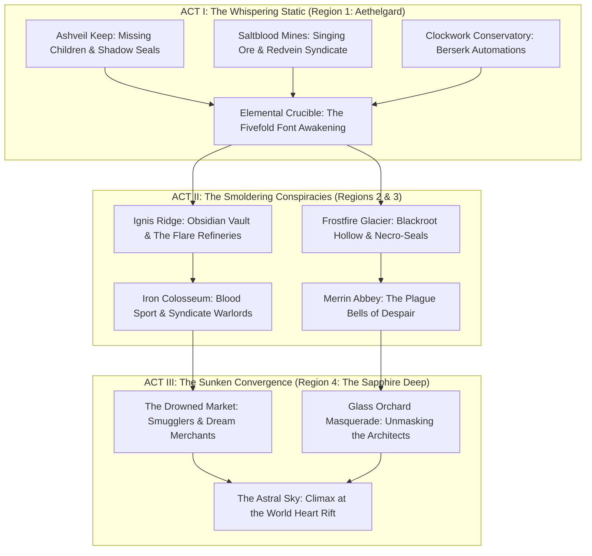
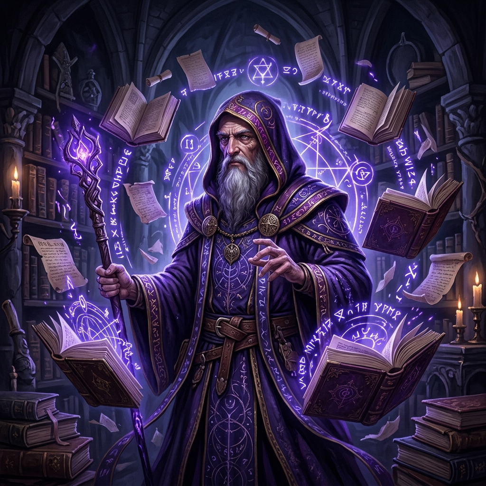
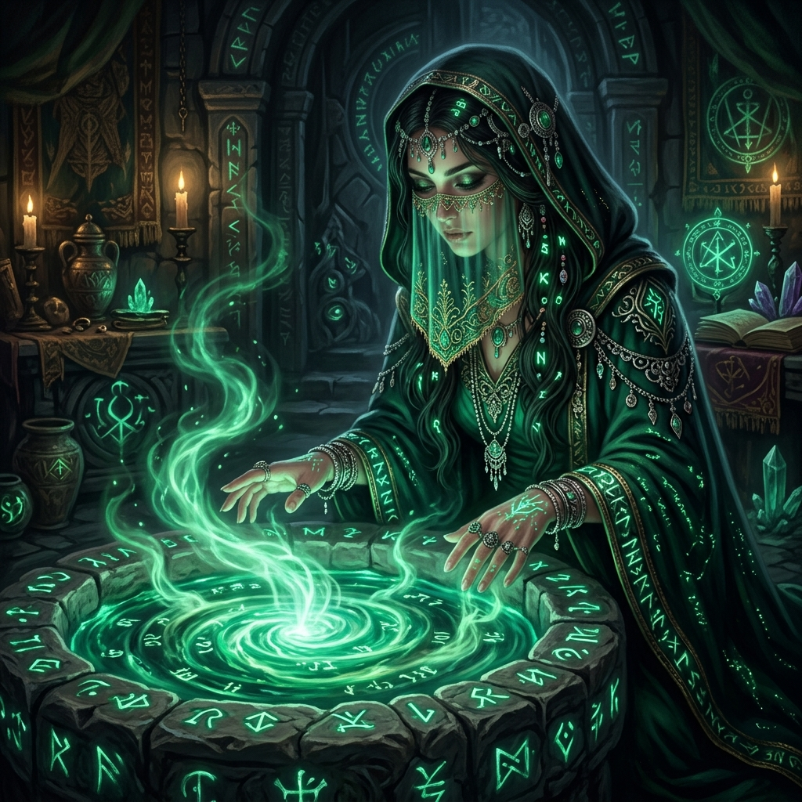
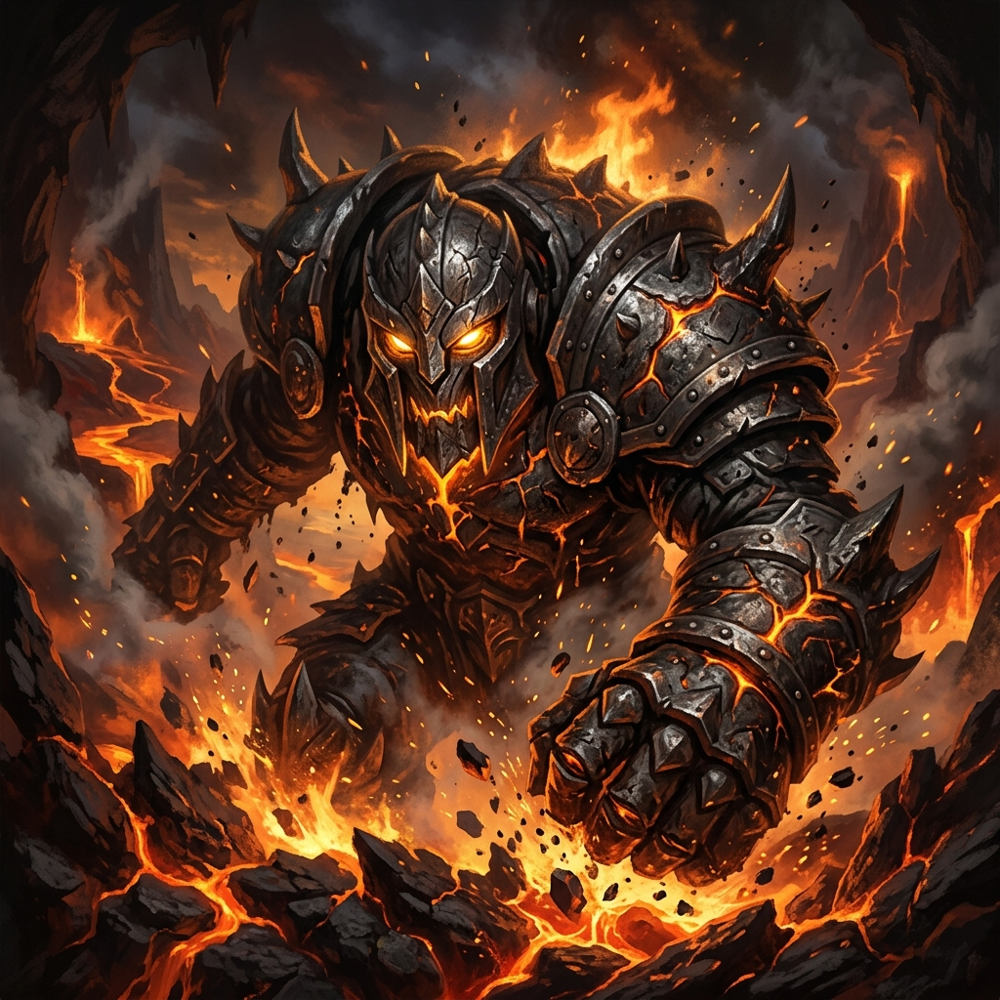

# Shattered Saga — Official Player's Game Manual & Rules Almanac

> **Document Version:** 7.0 (Official Player's Handbook & Campaign Almanac Edition)  
> **Status:** Authoritative Living Master Reference  
> **Primary Document Locations:**
> - Master Repository Document: [`website/src/data/GAME_RULES.md`](file:///C:/Users/hansi/Dropbox/MSI%20folders/Documents/_ACALI%20Studios/Shattered%20Saga/website/src/data/GAME_RULES.md)
> - Workspace Reference: [`Shattered Saga - Rules Reference.md`](file:///C:/Users/hansi/Dropbox/MSI%20folders/Documents/_ACALI%20Studios/Shattered%20Saga/Shattered%20Saga%20-%20Rules%20Reference.md)
> - In-Game Help Data Module: [`website/src/data/rulesHelp.js`](file:///C:/Users/hansi/Dropbox/MSI%20folders/Documents/_ACALI%20Studios/Shattered%20Saga/website/src/data/rulesHelp.js)
> - Living Chat Artifact: [`running_game_rules.md`](file:///C:/Users/hansi/.gemini/antigravity/brain/d917b103-4655-435d-9a0d-cf433fb73ff2/running_game_rules.md)

---



```
================================================================================
                    SHATTERED SAGA — PLAYER'S GAME MANUAL
================================================================================
  "Power is not given. It is answered." — Ilyra of the Fivefold Font
================================================================================
```

## Table of Contents

- [Prologue: The Shattered World](#prologue-the-shattered-world)
  - [The Great Sundering](#the-great-sundering)
  - [The Five Cosmic Elements](#the-five-cosmic-elements)
  - [The Four Known Realms & Cartography](#the-four-known-realms--cartography)
- [Chapter 1: Quick Start Guide](#chapter-1-quick-start-guide)
  - [Playing in Five Minutes](#playing-in-five-minutes)
  - [The Core Gameplay Loop](#the-core-gameplay-loop)
  - [Understanding the Turn Economy](#understanding-the-turn-economy)
- [Chapter 2: Creating Your Champion](#chapter-2-creating-your-champion)
  - [Step 1: Elemental Affinity](#step-1-elemental-affinity)
  - [Step 2: Age Tiers & Life Experience](#step-2-age-tiers--life-experience)
  - [Step 3: Backgrounds & Starting Professions](#step-3-backgrounds--starting-professions)
  - [Step 4: The Eight Core Attributes](#step-4-the-eight-core-attributes)
  - [Step 5: Virtues, Vices & Moral Philosophy](#step-5-virtues-vices--moral-philosophy)
  - [Step 6: The Morality Scale & Roleplay Modifiers](#step-6-the-morality-scale--roleplay-modifiers)
- [Chapter 3: The 36 Canonical Skills Almanac](#chapter-3-the-36-canonical-skills-almanac)
  - [Master Skill Index & Dual-Attribute Pairings](#master-skill-index--dual-attribute-pairings)
  - [Exhaustive Skill Compendium (A to Z)](#exhaustive-skill-compendium-a-to-z)
- [Chapter 4: The Opposed Roll Engine](#chapter-4-the-opposed-roll-engine)
  - [The Master Roll Formula](#the-master-roll-formula)
  - [Primary Step-Die Progression](#primary-step-die-progression)
  - [Secondary Step-Die Progression](#secondary-step-die-progression)
  - [Skill Ranks as 1d2 Coin Flips](#skill-ranks-as-1d2-coin-flips)
  - [Calculating Margins & Outcome Tiers](#calculating-margins--outcome-tiers)
  - [Static Environmental Resistance vs Living Foes](#static-environmental-resistance-vs-living-foes)
- [Chapter 5: Combat & Tactical Warfare](#chapter-5-combat--tactical-warfare)
  - [Tactical Turn & Round Structure](#tactical-turn--round-structure)
  - [Action Economy in Melee & Ranged Skirmishes](#action-economy-in-melee--ranged-skirmishes)
  - [Active Defenses: Dodge, Block & Parry](#active-defenses-dodge-block--parry)
  - [The Multi-Attacker Swarm Penalty](#the-multi-attacker-swarm-penalty)
  - [Armor Soak & The Tactical Damage Matrix](#armor-soak--the-tactical-damage-matrix)
- [Chapter 6: Freeform Magic & The Weave](#chapter-6-freeform-magic--the-weave)
  - [Arcane Shaping vs Divine Manifestation](#arcane-shaping-vs-divine-manifestation)
  - [Spell Points (SP) & Dynamic Channeling Magnitude](#spell-points-sp--dynamic-channeling-magnitude)
  - [Planar Burnout, Fatigue Drain & Arcane Backlash](#planar-burnout-fatigue-drain--arcane-backlash)
- [Chapter 7: Survival, Time & Travel](#chapter-7-survival-time--travel)
  - [The Ten-Minute Exploration Turn](#the-ten-minute-exploration-turn)
  - [Day-Night Cycles & Lighting Conditions](#day-night-cycles--lighting-conditions)
  - [Rations, Hunger & Midnight Starvation](#rations-hunger--midnight-starvation)
  - [Fatigue Pool & The Eight-Hour Rest](#fatigue-pool--the-eight-hour-rest)
  - [Encumbrance & Carrying Capacity](#encumbrance--carrying-capacity)
- [Chapter 8: Health, Injury & The Resurrection Rite](#chapter-8-health-injury--the-resurrection-rite)
  - [Hit Points & Vitality Limits](#hit-points--vitality-limits)
  - [Bleeding Tiers 1 through 4](#bleeding-tiers-1-through-4)
  - [Reaching Zero HP: The Dying Countdown](#reaching-zero-hp-the-dying-countdown)
  - [The Resurrection Rite & The Attribute Sacrifice](#the-resurrection-rite--the-attribute-sacrifice)
  - [The Undead Curse & The Rite of Quiet Return](#the-undead-curse--the-rite-of-quiet-return)
  - [Gear Recovery Trails & Expiration Windows](#gear-recovery-trails--expiration-windows)
- [Chapter 9: The Campaign Saga: The Sundered Keystone](#chapter-9-the-campaign-saga-the-sundered-keystone)
  - [The Grand Campaign Arc: The Planar Convergence](#the-grand-campaign-arc-the-planar-convergence)
  - [Act I: The Whispering Static (Region 1: Aethelgard)](#act-i-the-whispering-static-region-1-aethelgard)
  - [Act II: The Smoldering Conspiracies (Regions 2 & 3)](#act-ii-the-smoldering-conspiracies-regions-2--3)
  - [Act III: The Sunken Convergence (Region 4: The Sapphire Deep)](#act-iii-the-sunken-convergence-region-4-the-sapphire-deep)
  - [The Recurring Antagonist Web](#the-recurring-antagonist-web)
  - [Elemental Affinity Resonance Loci](#elemental-affinity-resonance-loci)
  - [Campfire Interludes & Dynamic NPC Reactions](#campfire-interludes--dynamic-npc-reactions)
- [Chapter 10: The AI Game Master & Interactive Play](#chapter-10-the-ai-game-master--interactive-play)
  - [The Three Game Master Archetypes](#the-three-game-master-archetypes)
  - [Crafting Effective Player Prompts](#crafting-effective-player-prompts)
  - [Free-Roam Exploration vs Structured Quests](#free-roam-exploration-vs-structured-quests)
  - [Constrained Tag Engine Integration](#constrained-tag-engine-integration)
- [Chapter 11: Downtime, Economy & Training](#chapter-11-downtime-economy--training)
  - [Currency Denominations & Exchange Rates](#currency-denominations--exchange-rates)
  - [Trading, Bargaining & Merchant Reputations](#trading-bargaining--merchant-reputations)
  - [Repeatable Wilderness Patrols](#repeatable-wilderness-patrols)
  - [The Iron Colosseum Gladiatorial Arena](#the-iron-colosseum-gladiatorial-arena)
- [Chapter 12: Progression & Engine Authority](#chapter-12-progression--engine-authority)
  - [The Engine Authority Mandate](#the-engine-authority-mandate)
  - [Adventure Wave Progression](#adventure-wave-progression)
  - [Spendable Skill Points & Escalating Costs](#spendable-skill-points--escalating-costs)
  - [Milestone Boons & Signature Elemental Unlocks](#milestone-boons--signature-elemental-unlocks)
- [Appendix: User Interface & Quick Reference Sheet](#appendix-user-interface--quick-reference-sheet)

---

## Prologue: The Shattered World

### The Great Sundering
Five centuries before the dawn of your journey, the world of Elyria was unbroken—a flourishing realm held together by the **Prime Keystone**, an immense crystal font pulsing at the heart of the world. Through this keystone flowed the harmonious weave of all five primordial elements: Air, Earth, Fire, Water, and Aether.

Human ambition shattered paradise. In an event known as **The Great Sundering**, rival sorcerer-kings attempted to breach the boundary of the gods and bind the Prime Keystone directly into mortal vessels. The crystal shattered into five massive shards and millions of crystalline splinters. Tectonic plates buckled, mountains turned to glass, seas drained into boiling abyss-trenches, and planar static flooded the mortal sphere.

To prevent Elyria from dissolving completely into the void, an order of ancient sages known as the **Fivefold Keepers** sacrificed their physical bodies to bind the shards across four disparate provinces. These anchors halted total dissolution, but they locked the lands into an artificial, fragile equilibrium. Today, the world is known simply as **The Shattered Realm**.

```
                           [ THE PRIME KEYSTONE ]
                                     |
                +--------------------+--------------------+
                |                    |                    |
         [ AIR / STORM ]      [ EARTH / STONE ]    [ FIRE / ASH ]
                |                    |                    |
                +--------------------+--------------------+
                                     |
                          +----------+----------+
                          |                     |
                   [ WATER / TIDE ]      [ AETHER / WEAVE ]
```

### The Five Cosmic Elements
Every living being, relic, and spell in the realm carries an innate resonance with one of the five elements:

1. **Air (Zephyr / Gale):** The element of freedom, speed, perception, and thought. Associated with clear skies, cutting winds, lightning, and unburdened spirits. Air champions excel at agility, evasion, and ranged skirmishing.
2. **Earth (Terra / Granite):** The element of endurance, weight, protection, and patience. Associated with bedrock, iron, unyielding mountains, and ancient duty. Earth champions excel at soaking brutal blows, anchoring battle lines, and crafting durable relics.
3. **Fire (Ignis / Ember):** The element of passion, transformation, fury, and light. Associated with blazing furnaces, wild forest fires, lava, and fierce conviction. Fire champions unleash explosive bursts of destructive power and inspire allies.
4. **Water (Mare / Current):** The element of fluidity, adaptation, healing, and memory. Associated with flowing rivers, mist, deep ocean trenches, and quiet intuition. Water champions are unmatched in cleansing poisons, soothing grievous wounds, and outlasting opponents through flexible counters.
5. **Aether (Astral / Weave):** The mysterious fifth element that binds the other four. It is the raw fabric of time, space, soul energy, and destiny. Aether champions perceive invisible leylines, slip between spatial seams, and unravel hostile sorcery.

### The Four Known Realms & Cartography


The mortal lands are divided into four vast geopolitical provinces, each shaped by its proximity to the ancient keystone anchors:

#### Region 1: Aethelgard — The Verdant Lowlands & Gothic Keeps

* **Capital & Hubs:** High Aethel, Oakhaven, Greywash Crossroads
* **Terrain:** Rolling temperate forests, ancient yew groves, fertile farmland, deep river valleys, ruined stone castles, and forgotten crypts.
* **Key Adventures:** *Ashveil Keep, The Elemental Crucible, Saltblood Mines, Clockwork Conservatory, Sunken Spire, Greywash Bandit Crown, Thorn Treaty, Harvest Hill Hunger, Mirror War of Saint Orra*.
* **Lore:** The heart of old civilization. Aethelgard appears civilized on its surface, but beneath its rolling wheat fields lie sealed dungeons and ancient crypts where the planar static is beginning to whisper to the desperate and corrupt.

#### Region 2: Ignis Ridge — The Ashen Peaks & Iron Forges

* **Capital & Hubs:** Brass Gate, The Smoldering Spire, Caldera Basin
* **Terrain:** Jagged volcanic ridges, black basalt plateaus, rivers of sulfurous magma, choking ash clouds, and vast industrialized clockwork smelters.
* **Key Adventures:** *The Obsidian Vault, The Iron Colosseum, Brass Plague Tinkertown*.
* **Lore:** Dominated by ruthless merchant syndicates, dwarven forge-lords, and daring sellswords. Here, the crystalline drug known as **Flare** is mined from volcanic fissures, driving industrialists into manic greed and workers into demonic mutation.

#### Region 3: Frostfire Glacier — The Frozen Waste & Crypts

* **Capital & Hubs:** Rimewatch, Bleak Harbor, Merrin Abbey
* **Terrain:** Towering glaciers, howling blizzards, permafrost bogs, blackroot caverns, and frozen ship graveyards locked in eternal ice.
* **Key Adventures:** *Frostfire Crypt, Blackroot Hollow, Merrin Abbey Plague Bells*.
* **Lore:** A desolate frontier where ancient necromantic wardens slumber beneath miles of blue ice. The chilling toll of the Merrin Abbey bells warns that the ancient thermal seals are rotting away, threatening to unleash an undead plague across the world.

#### Region 4: The Sapphire Deep — The Sunken Reaches & Astral Isles

* **Capital & Hubs:** Coral Citadel, Ghost Quay, Skyhaven Arch
* **Terrain:** Coral reefs, drowned ancient cities, perpetual whirlpools, glass orchards, and floating islands suspended in the upper atmosphere.
* **Key Adventures:** *The Astral Sky, The Drowned Market, Glass Orchard Masquerade*.
* **Lore:** The edge of mortal existence. In the Sapphire Deep, the boundary between the mortal realm and the astral plane is paper-thin. Gravity fluctuates, drowned markets trade in stolen dreams, and the secretive Planar Architects assemble their grand designs.

---

## Chapter 1: Quick Start Guide

### Playing in Five Minutes
*Shattered Saga* blends the deep, strategic character building of classic tabletop RPGs with the boundless responsive narrative of an AI Game Master.

1. **You Are the Champion:** You control a single adventurer in a harsh, living fantasy world. You make choices, speak dialogue, fight monsters, decipher puzzles, and forge alliances.
2. **The AI Is the Storyteller:** The AI Game Master narrates the sights, sounds, smells, and tactical movements of the world, responding directly to your intentions.
3. **The Engine Is the Law:** Unlike loose AI chat games, the AI does *not* roll dice or decide your statistics. Shattered Saga runs on a rigorous, deterministic code engine. When you leap a chasm, swing a broadsword, or bargain for rations, the engine rolls authentic polyhedral dice behind the scenes, calculates armor and margins, and hands the mechanical outcome to the AI to narrate.

### The Core Gameplay Loop

```
+--------------------------------------------------------------------------+
| 1. NARRATIVE PRESENTATION                                                |
|    The AI Game Master presents the scene, enemy positions, and sensory   |
|    details of your current room.                                         |
+--------------------------------------------------------------------------+
                                     |
                                     v
+--------------------------------------------------------------------------+
| 2. PLAYER INTENT & ACTION                                                |
|    Choose a suggested tactical response OR write your own custom action  |
|    in the prompt box describing exactly what your champion attempts.     |
+--------------------------------------------------------------------------+
                                     |
                                     v
+--------------------------------------------------------------------------+
| 3. ENGINE OPPOSED RESOLUTION                                             |
|    The engine rolls your Step-Die + Secondary Die + Skill d2 coins       |
|    against the opponent's roll or environmental resistance DC.           |
+--------------------------------------------------------------------------+
                                     |
                                     v
+--------------------------------------------------------------------------+
| 4. OUTCOME & CONSEQUENCE                                                 |
|    The engine applies damage, updates health, consumes rations/time,     |
|    and instructs the GM to narrate triumph, stalemate, or consequence.   |
+--------------------------------------------------------------------------+
```

### Understanding the Turn Economy
- **Exploration Turns:** In peaceful or dungeon exploration, each player action advances the in-game clock by **10 minutes**. Searching a room thoroughly or picking a lock takes deliberate time.
- **Combat Rounds:** In battle, time slows to intense **10-second tactical combat rounds**. You have 1 major action (Attack, Spell, Sprint, Use Item) and active defensive reactions (Dodge, Block, Parry) against incoming enemy strikes.
- **Short Rests (1 Hour):** Spend 1 hour to catch your breath, patch minor wounds with First Aid, and recover minor fatigue.
- **Full Rest (8 Hours):** Pitch a bedroll, consume 1 Ration, and sleep for 8 hours to recover all Spell Points, restore up to 40 Fatigue, and clear temporary debuffs.

---

## Chapter 2: Creating Your Champion

### Step 1: Elemental Affinity
Your soul resonates with one of the five cosmic elements. This affinity defines your spiritual core and grants a powerful **Signature Elemental Ability** once per rest:

| Element | Theme & Disposition | Signature Ability | In-Game Effect |
| :--- | :--- | :--- | :--- |
| **Fire** | Passion, Fury, Direct Action | **Cinderbreath** | Unleash a cone of searing flame dealing $2\text{d}6$ raw damage or igniting hazards. |
| **Earth** | Fortitude, Duty, Unyielding | **Stone Mantle** | Skin hardens to granite for 3 rounds, adding $+1\text{d}6$ soak to all incoming physical damage. |
| **Air** | Agility, Freedom, Perception | **Gale Flash** | Burst of dust and wind blinding a chosen foe for 2 rounds, forcing disadvantage on their attacks. |
| **Water** | Adaptation, Memory, Renewal | **Tide Mend** | Cooling water cleanses your body, restoring $1\text{d}6+2$ HP and cleansing Bleeding Tier 1–2. |
| **Aether** | Intuition, Spatial Weave, Time | **Threadstep** | Slip through an aether seam to escape restraints or turn a failed non-damage roll into narrow success. |

### Step 2: Age Tiers & Life Experience
Your age represents the balance between physical vigor and accumulated wisdom:

* **Youth (16–24 Years):** High physical energy, reckless drive. $+1$ to Power or Coordination; $-1$ to Willpower or Intellect. Maximum starting physical attributes may reach 4.
* **Adult (25–39 Years):** Peak physical and mental balance. Free allocation across all attributes up to the starting cap of 3.
* **Middle-Aged (40–54 Years):** Seasoned veteran. $+1$ to Intellect or Charisma; $-1$ to Vigor. Starts with $+2$ bonus Skill Ranks.
* **Elder / Veteran (55+ Years):** Vast lifetime of lore and mental discipline. $+1$ to Willpower and $+1$ to Attunement; $-2$ across physical attributes. Starts with $+4$ bonus Skill Ranks and $+5$ starting SP.

### Step 3: Backgrounds & Starting Professions
Choose a life calling that explains your early training and starting gear:

1. **Iron Legionnaire (Soldier):** Trained in heavy armor, shields, and brutal discipline. Starts with Heavy Armor, Broadsword, Iron Shield, and Rank 2 in *Heavy Weapons* and *Blocking*.
2. **Shadow Scout (Outlaw / Ranger):** Skulked through criminal alleyways or untamed wilderness. Starts with Leather Jerkin, Shortbow, Daggers, and Rank 2 in *Stealth* and *Perception*.
3. **Scholarly Hedge Mage (Arcanist):** Studied the forbidden leylines in quiet libraries. Starts with Scholar's Robes, Oak Focus Staff, Grimoire, and Rank 2 in *Arcane Shaping* and *Lore*.
4. **Wandering Pilgrim (Cleric / Healer):** Devoted to divine communion and aiding the sick. Starts with Linen Vestments, Mending Herbs, Blessed Mace, and Rank 2 in *Divine Manifestation* and *Healing*.
5. **Guild Artisan (Smith / Alchemist):** Master of practical crafts and trade negotiations. Starts with Artisan's Leather, Smithing Hammer, 10 Alchemical Vials, and Rank 2 in *Smithing* and *Negotiation*.

### Step 4: The Eight Core Attributes
Every mortal in Shattered Saga is defined by 8 fundamental attributes. Attributes determine the size of polyhedral dice rolled during checks:

```
+--------------------------------------------------------------------------------+
| PHYSICAL ATTRIBUTES                                                            |
| - Power (POW):        Raw muscular force, brute strength, heavy blows, lifting |
| - Coordination (CRD): Reflexes, manual dexterity, acrobatics, aim, balance     |
| - Vigor (VIG):        Stamina, physical toughness, health pool, disease resist |
+--------------------------------------------------------------------------------+
| MENTAL ATTRIBUTES                                                              |
| - Willpower (WIL):    Mental grit, courage, resisting terror, spell endurance  |
| - Intellect (INT):    Logic, analytical deduction, grimoires, tactical lore    |
| - Charisma (CHA):     Force of personality, leadership, charm, intimidation    |
+--------------------------------------------------------------------------------+
| SPIRITUAL & EMOTIONAL ATTRIBUTES                                               |
| - Attunement (ATN):   Sensitivity to magical leylines, aether manipulation     |
| - Empathy (EMP):      Emotional insight, intuition, reading minds and motives  |
+--------------------------------------------------------------------------------+
```

### Step 5: Virtues, Vices & Moral Philosophy
Your character's inner psyche shapes both the narrative and the dice:

* **Virtues:** *Courage, Compassion, Justice, Humility, Prudence, Loyalty, Honesty.*
* **Vices:** *Wrath, Greed, Pride, Deceit, Cowardice, Envy, Gluttony.*
* **Philosophies:**
  * *Preservation:* Protect the weak, preserve the old ways, rebuild what was broken.
  * *Evolution:* Embrace planar static, seek forbidden knowledge, adapt through danger.
  * *Dominion:* The strong must lead; law and order must be enforced by an iron fist.
  * *Freedom:* Break shackles, defy tyrannical lords and ancient gods alike.

### Step 6: The Morality Scale & Roleplay Modifiers

#### Roleplay Modifier (`[roleplay_modifier: +1 / -1]`)
When you write an action that strongly embodies your chosen **Virtue** or acts directly in harmony with your **Philosophy**, the engine awards a **$+1$ bonus modifier** to your roll. Conversely, acting out of character or succumbing to weakness without justification incurs a **$-1$ penalty modifier**.

#### The Morality Meter (-10 to +10)
Your moral actions move your global morality slider:

```
[-10: Malevolent] <--- [-5: Ruthless] <--- [0: Pragmatic] ---> [+5: Virtuous] ---> [+10: Righteous]
```

* **Righteous (+6 to +10):** Radiate inspiring conviction. Allies gain courage, commoners welcome you with discounts, and your divine prayers roll with $+2$ bonus soak vs dark planar damage.
* **Pragmatic (-3 to +3):** Unburdened by dogmatism. You find creative solutions, barter easily with criminals and nobles alike.
* **Malevolent (-6 to -10):** Feared throughout the provinces. Intimidation checks receive $+2$ bonus roll, cutthroats hesitate to cross you, but holy sanctuaries close their gates.

---

## Chapter 3: The 36 Canonical Skills Almanac

Skills represent focused, practiced training. Shattered Saga features **36 canonical skills**, each governed by a **Primary Attribute** (core competence) and a **Secondary Attribute** (supporting finesse).

```
+-------------------------------------------------------------------------------+
|                      MASTER SKILL ARCHITECTURE                                |
|                                                                               |
|  SKILL TOTAL = Primary Attribute Die + Secondary Attribute Die + (Rank x 1d2) |
+-------------------------------------------------------------------------------+
```

### Master Skill Index & Dual-Attribute Pairings

| # | Skill Name | Category | Primary Attribute | Secondary Attribute |
| :-: | :--- | :--- | :--- | :--- |
| **1** | **Acrobatics** | Physical | Coordination | Power |
| **2** | **Alchemical Lore** | Knowledge | Intellect | Attunement |
| **3** | **Alchemy** | Craft | Intellect | Coordination |
| **4** | **Animal Handling** | Survival | Empathy | Willpower |
| **5** | **Appraisal** | Intrigue | Intellect | Charisma |
| **6** | **Arcane Drawing** | Magical | Attunement | Coordination |
| **7** | **Arcane Shaping** | Magical | Intellect | Attunement |
| **8** | **Athletics** | Physical | Power | Vigor |
| **9** | **Blocking** | Combat | Power | Coordination |
| **10** | **Brawling** | Combat | Power | Coordination |
| **11** | **Deception** | Intrigue | Charisma | Intellect |
| **12** | **Disguise** | Intrigue | Coordination | Charisma |
| **13** | **Divine Communion** | Spiritual | Willpower | Attunement |
| **14** | **Divine Manifestation**| Spiritual | Attunement | Willpower |
| **15** | **Dodging** | Combat | Coordination | Vigor |
| **16** | **First Aid** | Survival | Intellect | Empathy |
| **17** | **Forging** | Craft | Coordination | Intellect |
| **18** | **Heavy Weapons** | Combat | Power | Vigor |
| **19** | **Insight** | Social | Empathy | Intellect |
| **20** | **Intimidation** | Social | Charisma | Power |
| **21** | **Investigation** | Knowledge | Intellect | Perception* |
| **22** | **Leadership** | Social | Charisma | Willpower |
| **23** | **Light Weapons** | Combat | Coordination | Power |
| **24** | **Lore** | Knowledge | Intellect | Empathy |
| **25** | **Medicine** | Knowledge | Intellect | Willpower |
| **26** | **Mining** | Craft | Power | Vigor |
| **27** | **Negotiation** | Social | Charisma | Empathy |
| **28** | **Performance** | Social | Charisma | Coordination |
| **29** | **Persuasion** | Social | Charisma | Empathy |
| **30** | **Polearms** | Combat | Coordination | Power |
| **31** | **Ranged Weapons** | Combat | Coordination | Perception* |
| **32** | **Sleight of Hand** | Intrigue | Coordination | Intellect |
| **33** | **Smithing** | Craft | Power | Coordination |
| **34** | **Stealth** | Intrigue | Coordination | Intellect |
| **35** | **Survival** | Survival | Vigor | Intellect |
| **36** | **Tracking** | Survival | Intellect | Coordination |

*(Note: For skills utilizing Perception, Perception is tested via Coordination + Empathy).*

---

### Exhaustive Skill Compendium (A to Z)

#### 1. Acrobatics (Coordination + Power)
* **Scope:** Nimble balance, tumbling across collapsing architecture, leaping between rooftops, and absorbing fall impact.
* **Exploration:** Walking along grease-coated chains over the caldera in Ignis Ridge; leaping chasms in the sunken ruins.
* **Combat:** Tumbling behind a heavily shielded boss to bypass their front shield defense.
* **Practical Example:** *A stone bridge collapses beneath your feet. You test Acrobatics against DC 11. Rolling a 14 grants a margin of $+3$, allowing you to tuck into a roll and land safely on a narrow ledge below.*

#### 2. Alchemical Lore (Intellect + Attunement)
* **Scope:** Theoretical knowledge of planar compounds, toxic reagents, mutated crystal veins, and rare catalysts.
* **Exploration:** Identifying a pool of luminescent swamp ooze as volatile dragon-bile before it touches your torch.
* **intrigue:** Spotting the telltale signs of refined "Flare" poisoning in a murdered magistrate's bloodstream.
* **Practical Example:** *You inspect strange red residue on an assassin's dagger. With an Alchemical Lore check of 12 vs DC 9, you identify it as concentrated Redvein Cinnabar, tracing the weapon directly to Baron Threx's private refinery.*

#### 3. Alchemy (Intellect + Coordination)
* **Scope:** The physical craft of brewing potions, refining antitoxins, distilling Greek fire, and neutralizing acid traps.
* **Survival:** Brewing healing draughts and purifying corrupted marsh water during field camps.
* **Combat:** Throwing smoke canisters or alchemical flash-powder to blind a pack of charging ghouls.
* **Practical Example:** *Using 2 harvested frost-spores and an alchemical vial, you roll Alchemy (13 vs DC 10). You successfully brew a Vial of Frostward Elixir, granting 2 hours of resistance to freezing temperatures.*

#### 4. Animal Handling (Empathy + Willpower)
* **Scope:** Calming frightened mounts, training hunting hounds, soothing wild beasts, and discerning predator territorial cues.
* **Exploration:** Pacifying a snarling dire-wolf pack guarding a forest burial mound without spilling blood.
* **Combat:** Keeping your warhorse steady while facing the terrifying roar of a manticore.
* **Practical Example:** *You lower your weapons and extend an open hand to a wounded shadow-hound. Rolling Animal Handling (15 vs DC 12), the beast sniffs your fingers, calms down, and guides you to a hidden path.*

#### 5. Appraisal (Intellect + Charisma)
* **Scope:** Evaluating the true monetary, historic, and magical worth of relics, gems, art pieces, and antique weaponry.
* **Economy:** Spotting counterfeit coins, assessing looted jewelry, and determining fair market value.
* **Social:** Praising a merchant's genuine masterpiece to earn their deep personal trust.
* **Practical Example:** *A shady dealer in the Drowned Market offers a tarnished bronze amulet for 50 silver. Your Appraisal check reveals it is a pre-Sundering imperial seal worth at least 300 silver, enabling you to purchase it at a steep bargain.*

#### 6. Arcane Drawing (Attunement + Coordination)
* **Scope:** Inscribing physical circles, carving protective runes into stone, tracing glyphs into air, and etching warding sigils.
* **Exploration:** Drawing a circle of warding to prevent planar apparitions from interrupting your rest.
* **Combat:** Carving explosive elemental glyphs across a doorway to ambush pursuers.
* **Practical Example:** *With an Arcane Drawing roll of 16 vs DC 13, you trace glowing chalk glyphs along the chapel archway. When the shadow demon charges, the ward flashes, repelling the demon back into the darkness.*

#### 7. Arcane Shaping (Intellect + Attunement)
* **Scope:** The active molding of raw arcane energy into destructive beams, protective shields, or kinetic force.
* **Combat:** Hurling arcs of lightning, hurling kinetic force-waves, or forming translucent barriers against incoming arrows.
* **Exploration:** Levitation of heavy portcullis gates or dispelling magical locks.
* **Practical Example:** *Channeling 3 Spell Points, you shape an atmospheric shockwave to shatter a goblin barricade. You roll Arcane Shaping (17 vs DC 12), blowing the wooden palisade to splinters.*

#### 8. Athletics (Power + Vigor)
* **Scope:** Sustained physical exertion: climbing steep cliff faces, swimming through raging rapids, breaking down doors, and sprinting.
* **Exploration:** Scaling the frozen ice walls of Frostfire Glacier; pulling a trapped comrade from quicksand.
* **Combat:** Shoving an armored knight off a rampart or tackling a fleeing spy.
* **Practical Example:** *You throw your shoulder into the barred oak door of Ashveil Keep. With an Athletics roll of 14 vs the door's static resistance of 10, the heavy timber bursts inward with a thunderous crack.*

#### 9. Blocking (Power + Coordination)
* **Scope:** Interposing a buckler, kite shield, or reinforced weapon directly into the path of an enemy attack to absorb impact.
* **Combat:** The primary shield defense check. Adding shield dice directly to your defense roll.
* **Tactical:** Shield-bashing enemies to disrupt their spellcasting or break their guard.
* **Practical Example:** *A hulking ogre swings a spiked club at your chest. You raise your tower shield and roll Blocking (Power d10 + Coordination d4+1 + Shield d6 = 16). The club crashes into your shield with teeth-rattling force, but your footing holds firm and you take 0 damage.*

#### 10. Brawling (Power + Coordination)
* **Scope:** Unarmed pugilism, dirty tavern fighting, headbutts, grappling, wrestling, and improvised barstool strikes.
* **Combat:** Subduing guards non-lethally; disarming opponents in tight corridors where blades cannot swing.
* **Social:** Winning tavern brawls to earn the respect of rough dockworkers and mercenaries.
* **Practical Example:** *An assassin pins your sword arm against the wall. You test Brawling (12 vs 9) to drive an elbow into his throat, wrenching free and sending his dagger skittering across the flagstones.*

#### 11. Deception (Charisma + Intellect)
* **Scope:** Crafting convincing falsehoods, bluffing past watchful sentries, feigning injuries, and running cons.
* **Social:** Convincing gate guards that you are an imperial inspector traveling under seal.
* **Combat:** Feigning weakness in combat to lure an aggressive opponent into a reckless lunging strike.
* **Practical Example:** *Cornered by bandits in the Greywash woods, you pull out an empty glass vial and claim it contains deadly planar gas. Your Deception roll of 15 beats their Insight of 11; the bandits back away with raised hands.*

#### 12. Disguise (Coordination + Charisma)
* **Scope:** Changing your physical appearance, clothing, voice, and mannerisms to impersonate another person or social class.
* **Intrigue:** Infiltrating the Glass Orchard Masquerade disguised as a noble courtier.
* **Survival:** Blending in among plague refugees to bypass quarantine checkpoints.
* **Practical Example:** *Using charcoal, stolen robes, and altered posture, you roll Disguise (14 vs DC 11). The fortress guards wave you past the gatehouse, believing you are a wandering pilgrim from Merrin Abbey.*

#### 13. Divine Communion (Willpower + Attunement)
* **Scope:** Meditative prayers, communing with celestial patrons or ancestral spirits, interpreting omens, and seeking guidance.
* **Spiritual:** Discerning whether a ruined altar still retains its sacred consecration.
* **Exploration:** Asking the spirits of ancient martyrs for the safe path through a haunted necropolis.
* **Practical Example:** *Kneeling before the cracked altar in Ashveil Chapel, you roll Divine Communion (16 vs DC 12). A warm golden light bathes your mind, revealing the exact binding prayer needed to banish Malachar.*

#### 14. Divine Manifestation (Attunement + Willpower)
* **Scope:** Channeling celestial grace to perform miracles: healing grievous wounds, expelling planar corruption, and radiant smites.
* **Combat:** Unleashing holy radiance that blinds undead or incinerates demonic abominations.
* **Survival:** Purifying poisoned food and water; curing virulent pestilence.
* **Practical Example:** *Laying hands upon a dying ally at 0 HP, you spend 4 SP and roll Divine Manifestation (15 vs DC 10). Holy light stitches their severed flesh together, restoring 12 Hit Points and halting the dying countdown.*

#### 15. Dodging (Coordination + Vigor)
* **Scope:** Evasive maneuvers, ducking under sweeping weapons, rolling away from breath attacks, and sidestepping traps.
* **Combat:** The universal defensive roll against melee and ranged attacks when unshielded.
* **Hazard:** Leaping clear of a collapsing ceiling or dart trap.
* **Practical Example:** *A frost drake snaps its jaws at your torso. You roll Dodging (Coordination d10 + Vigor d6 = 13) against the drake's attack roll of 11. You dive sideways under the snapping teeth, rolling safely to your feet.*

#### 16. First Aid (Intellect + Empathy)
* **Scope:** Emergency battlefield triage: binding arterial bleeding, setting broken bones, applying tourniquets, and reviving knocked-out allies.
* **Survival:** Halting Bleeding Tier 1–3 in the field before infection or blood loss claims a life.
* **Exploration:** Stabilizing injured NPCs to extract vital intelligence from them.
* **Practical Example:** *A party member suffers Bleeding Tier 2 after a slashing broadsword strike. You spend 1 cloth bandage and roll First Aid (13 vs DC 10). You successfully dress the wound, removing the bleeding condition.*

#### 17. Forging (Coordination + Intellect)
* **Scope:** Creating counterfeit documents, replicating noble wax seals, copying signatures, and altering ledger records.
* **Intrigue:** Forging travel permits to cross into the closed military zones of Ignis Ridge.
* **Economy:** Altering debts in a corrupt moneylender's record book.
* **Practical Example:** *By candlelight, you carefully replicate the wax seal of Baron Threx onto a parchment manifest. With a Forging roll of 16 vs DC 12, the document passes visual inspection by the harbor master.*

#### 18. Heavy Weapons (Power + Vigor)
* **Scope:** Two-handed greatswords, battleaxes, warhammers, and mauls. High raw kinetic destruction.
* **Combat:** Sunder enemy shields, crush heavy plate armor, and cleave through multiple weak foes.
* **Tactical:** $+2$ armor soak bypass when wielding crushing warhammers against heavy plate.
* **Practical Example:** *You swing a two-handed steel maul at a stone gargoyle. You roll Heavy Weapons (16 vs 11). The crushing impact cracks the stone torso, dealing 12 bludgeoning damage and staggering the monster.*

#### 19. Insight (Empathy + Intellect)
* **Scope:** Reading body language, detecting deception, sensing hidden hostility, and discerning character motives.
* **Social:** The natural counter to Deception. Discerning when an NPC is withholding vital facts or setting a trap.
* **Combat:** Anticipating an opponent's tactical feint before they strike.
* **Practical Example:** *While speaking with Mayor Vance, you notice his twitching fingers and darting eyes whenever Lord Voss is mentioned. Your Insight roll of 14 beats his Deception (10); you realize Vance is hiding a dark secret.*

#### 20. Intimidation (Charisma + Power)
* **Scope:** Coercion through menacing presence, physical threats, display of weapons, or terrifying reputation.
* **Social:** Forcing a captured bandit to reveal the secret entrance to the mountain hideout.
* **Combat:** Roaring in battle to demoralize enemy ranks, forcing them to hesitate or flee.
* **Practical Example:** *You slam your blood-stained battleaxe onto the table and step into the smuggler's personal space. With an Intimidation roll of 15 vs his Willpower (10), the smuggler breaks and confesses everything.*

#### 21. Investigation (Intellect + Perception)
* **Scope:** Searching rooms for hidden compartments, piecing together clues at a crime scene, and analyzing cipher codes.
* **Exploration:** Locating the hidden latch on a bookcase inside Lord Voss's private study.
* **intrigue:** Reconstructing the timeline of an assassination from footprint angles and blood spatters.
* **Practical Example:** *You inspect a blank stone wall in the crypt. With an Investigation roll of 14 vs DC 11, you discover subtle mortar discoloration and a hidden pressure brick that slides the wall open.*

#### 22. Leadership (Charisma + Willpower)
* **Scope:** Inspiring troops, coordinating allies during combat, maintaining party morale, and commanding hirelings.
* **Combat:** Issuing tactical commands that grant allies $+1$ on their next attack or defense roll.
* **Social:** Rallying terrified villagers to take up pitchforks and defend their homes against goblins.
* **Practical Example:** *As goblin archers shower the courtyard with arrows, you raise your sword and shout a rallying cry. Your Leadership roll (15 vs DC 11) breaks the villagers' panic, reforming them into a steady defensive line.*

#### 23. Light Weapons (Coordination + Power)
* **Scope:** Shortswords, rapiers, daggers, scimitars, and throwing knives. Precision and speed.
* **Combat:** Finesse strikes, parrying incoming blades, and targeting vulnerable chinks in enemy armor.
* **Tactical:** $+2$ bonus damage against unarmored targets on slashing weapons.
* **Practical Example:** *You lunge forward with a steel rapier, aiming for the slit in a knight's visor. Rolling Light Weapons (17 vs Defense 12) grants a margin of $+5$, driving the tip home for critical piercing damage.*

#### 24. Lore (Intellect + Empathy)
* **Scope:** Historical legends, ancient dynasties, mythological gods, planar cosmology, and archaic languages.
* **Knowledge:** Deciphering ancient inscriptions written before the Great Sundering.
* **Tactical:** Recalling the specific elemental weakness of a rare monster (e.g., trolls regenerating unless burned).
* **Practical Example:** *You examine the cracked carvings on the Fivefold Gate. With a Lore roll of 16 vs DC 12, you recall the ancient rite of Ilyra and explain to your companions how the mirror trial operates.*

#### 25. Medicine (Intellect + Willpower)
* **Scope:** Long-term pathology, diagnosing strange planar diseases, performing surgeries, and creating antitoxins.
* **Survival:** Curing virulent infections like the Brass Plague before they permanently mutate host tissue.
* **Forensics:** Performing autopsies to determine the exact cause and time of death.
* **Practical Example:** *A companion has fallen into a feverish delirium from ghoul claws. You roll Medicine (14 vs DC 11) to lance the blackrot infection and administer boiling willow bark, stabilizing their condition.*

#### 26. Mining (Power + Vigor)
* **Scope:** Excavating ore, assessing structural stability in tunnels, swinging pickaxes, and identifying rich gemstone veins.
* **Exploration:** Spotting an imminent cave-in in the Saltblood Mines and bracing the ceiling beams before disaster strikes.
* **Craft:** Extracting raw planar crystals without triggering explosive static discharge.
* **Practical Example:** *Examining the cracked ceiling of the lower salt shaft, you test Mining (13 vs DC 10). You identify the structural fault line and guide the party through a safe side-shaft before the roof collapses.*

#### 27. Negotiation (Charisma + Empathy)
* **Scope:** Formal diplomacy, commercial bargaining, treaty mediation, resolving hostile disputes, and establishing mutual trust.
* **Economy:** Reducing merchant prices by up to 20% or securing premium payouts for rare artifacts.
* **Social:** Brokering the delicate ceasefire between the forest dryads and human loggers in the *Thorn Treaty*.
* **Practical Example:** *Facing the hostile village council in Ashveil, you address their fears with measured diplomacy. Rolling Negotiation (Charisma d8 + Empathy d6 + Skill 2d2 = 15 vs Council DC 11), you convince them to grant you supplies and the crypt keys.*

#### 28. Performance (Charisma + Coordination)
* **Scope:** Music, dramatic oration, stage presence, juggling, storytelling, and public distractions.
* **Social:** Winning coin in taverns; charming noble courtiers at royal banquets.
* **Infiltration:** Staging an elaborate musical diversion in a town square while a companion picks a vault lock.
* **Practical Example:** *In the crowded taproom of Rimewatch, you strike your lute and sing an ancient ballad of the Frostfire kings. Your Performance roll of 16 vs DC 12 captivates the room, allowing your partner to slip upstairs unnoticed.*

#### 29. Persuasion (Charisma + Empathy)
* **Scope:** Appealing to reason, shared morality, personal loyalty, or emotion to sway an individual's decision.
* **Social:** Convincing a mercenary to abandon a cruel master and fight for your cause.
* **Intrigue:** Swaying a witness to testify before the High Court against Baron Threx.
* **Practical Example:** *You appeal to Sera's sense of duty to her miners in the Saltblood depths. With a Persuasion roll of 14 vs DC 10, she agrees to guide you into the deepest shaft despite the danger.*

#### 30. Polearms (Coordination + Power)
* **Scope:** Spears, halberds, pikes, glaves, and quarterstaffs. Reach and tactical zoning.
* **Combat:** Keeping charging beasts at bay; impaling mounted knights before they reach strike distance.
* **Tactical:** Free counter-attack when a charging enemy enters your weapon reach.
* **Practical Example:** *A warhound charges across the courtyard. You plant your halberd in the dirt and brace. Rolling Polearms (15 vs 10), the halberd impales the beast before its jaws can reach your throat.*

#### 31. Ranged Weapons (Coordination + Perception)
* **Scope:** Longbows, recurve shortbows, heavy crossbows, and slings.
* **Combat:** Sniping sentries from shadows; picking off enemy spellcasters from across the battlefield.
* **Tactical:** Heavy crossbows penetrate light armor soak; longbows have superior range.
* **Practical Example:** *From atop a guard tower, you notch an arrow and aim for a goblin carrying a horn. Rolling Ranged Weapons (16 vs DC 12), your arrow pierces the horn before the alarm can be raised.*

#### 32. Sleight of Hand (Coordination + Intellect)
* **Scope:** Picking pockets, palming keys, cutting purses, concealing small weapons, and delicate lock manipulation.
* **Intrigue:** Stealing the jailer's bronze keyring as you walk past his cell door.
* **Combat:** Concealing a poisoned stiletto past a security weapons search.
* **Practical Example:** *While shaking hands with a crooked merchant, you test Sleight of Hand (15 vs his Perception 11) to slide a stolen cipher ledger into your sleeve unnoticed.*

#### 33. Smithing (Power + Coordination)
* **Scope:** Metalworking, repairing shattered armor, tempering weapons, unbending shields, and evaluating ironwork.
* **Survival:** Repairing damaged armor during field rests to restore its full soak rating.
* **Craft:** Forging masterwork weapons with superior damage bonuses.
* **Practical Example:** *Using an anvil and forge in Brass Gate, you spend 4 hours and roll Smithing (16 vs DC 12) to reforge a shattered Voss family crest into a hardened buckler.*

#### 34. Stealth (Coordination + Intellect)
* **Scope:** Moving silently through shadows, camouflaging presence, avoiding scent trails, and staying out of sightlines.
* **Infiltration:** Slipping past watchful sentries and monstrous guardians without engaging in combat.
* **Combat:** Gaining surprise attacks from behind cover, dealing double damage on the first strike.
* **Practical Example:** *You stick to the dark arches of the great hall, stepping only on stone joints. Your Stealth roll of 15 beats the goblin sentries' Perception (10), allowing you to bypass them entirely.*

#### 35. Survival (Vigor + Intellect)
* **Scope:** Foraging for food and fresh water, building shelter in extreme weather, tracking game, and navigating the wild.
* **Survival:** Preventing exposure and hypothermia during blizzard storms in Frostfire Glacier.
* **Exploration:** Finding edible roots and clean springs when rations run dry.
* **Practical Example:** *Trapped in a sudden blizzard, you roll Survival (14 vs DC 11) to construct an insulated snow shelter and light a windproof fire, preventing party fatigue.*

#### 36. Tracking (Intellect + Coordination)
* **Scope:** Reading foot-prints, broken twigs, blood spatters, and wagon ruts to pursue targets across terrain.
* **Exploration:** Following the trail of kidnapped village children through the dense briars of Ashveil forest.
* **Hunting:** Locating the hidden lair of a subterranean mantid queen.
* **Practical Example:** *Inspecting the muddy village lane, you roll Tracking (15 vs DC 10). You spot goblin boot prints carrying heavy sacks, pointing directly toward the old yew graveyard.*

---

## Chapter 4: The Opposed Roll Engine

### The Master Roll Formula
Every active check in Shattered Saga is resolved using the **Opposed Roll Resolution Engine**:

$$\mathbf{\text{Player Total}} = \mathbf{\text{Primary Die}} + \mathbf{\text{Secondary Die}} + \sum_{i=1}^{\text{Ranks}} 1\mathbf{\text{d}}2_i + \mathbf{\text{Modifiers}}$$

$$\mathbf{\text{Resistance Total}} = \mathbf{\text{Opponent Primary Die}} + \mathbf{\text{Opponent Secondary Die}} + \sum_{i=1}^{\text{Ranks}} 1\mathbf{\text{d}}2_i + \mathbf{\text{Modifiers}}$$

$$\mathbf{\text{Margin}} = \mathbf{\text{Player Total}} - \mathbf{\text{Resistance Total}}$$

```
   [ Primary Attribute Die ]       -->  Determined by Primary Attribute score (1d4 to 1d12, 1d20)
+  [ Secondary Attribute Die ]     -->  Determined by Secondary Attribute score (1d2 to 1d6, 1d10)
+  [ Skill Ranks (0 to 5) ]        -->  Each rank rolls 1d2 coin flip (1 or 2)
+  [ Active Modifiers ]            -->  Gear bonuses, Roleplay modifiers, Morality bonuses, Penalties
-------------------------------------------------------------------------------------------------
=  Total Player Check Result
```

### Primary Step-Die Progression
The primary attribute score dictates the polyhedral die rolled:

| Attribute Score | Step-Die Rolled | Min / Max | Mathematical Average | Tier Description |
| :---: | :---: | :---: | :---: | :--- |
| **Score 1** | `1d4` | 1 – 4 | 2.50 | Feeble / Untrained |
| **Score 2** | `1d6` | 1 – 6 | 3.50 | Capable Average |
| **Score 3** | `1d8` | 1 – 8 | 4.50 | Seasoned Professional |
| **Score 4** | `1d10` | 1 – 10 | 5.50 | Masterful / Elite |
| **Score 5** | `1d12` | 1 – 12 | 6.50 | Apex Human Potential |
| **Score 6** | `1d20` | 1 – 20 | 10.50 | Monstrous / Demonic Boon |
| **Score 7** | `1d20 + 1d4` | 2 – 24 | 13.00 | Ancient Wyrm / Arch-Demon |
| **Score 8** | `1d20 + 1d6` | 2 – 26 | 14.00 | Demigod / Planar Sovereign |

### Secondary Step-Die Progression
The supporting attribute provides auxiliary stability:

| Attribute Score | Step-Die Rolled | Min / Max | Mathematical Average |
| :---: | :---: | :---: | :---: |
| **Score 1** | `1d2` | 1 – 2 | 1.50 |
| **Score 2** | `1d2 + 1` | 2 – 3 | 2.50 |
| **Score 3** | `1d4` | 1 – 4 | 2.50 |
| **Score 4** | `1d4 + 1` | 2 – 5 | 3.50 |
| **Score 5** | `1d6` | 1 – 6 | 3.50 |
| **Score 6** | `1d10` | 1 – 10 | 5.50 |
| **Score 7** | `1d10 + 1d2` | 2 – 12 | 7.00 |

### Skill Ranks as 1d2 Coin Flips
Unlike attributes which roll swingy polyhedrals, training produces reliable, consistent excellence. Each skill rank rolls a **1d2** (1 or 2):

* **Rank 0 (Untrained):** $+0$ (Raw instinct only)
* **Rank 1 (Novice):** $+1\text{d}2$ (Range: 1–2, Average: 1.5)
* **Rank 2 (Apprentice):** $+2\text{d}2$ (Range: 2–4, Average: 3.0)
* **Rank 3 (Journeyman):** $+3\text{d}2$ (Range: 3–6, Average: 4.5)
* **Rank 4 (Expert):** $+4\text{d}2$ (Range: 4–8, Average: 6.0)
* **Rank 5 (Master):** $+5\text{d}2$ (Range: 5–10, Average: 7.5)

### Calculating Margins & Outcome Tiers

| Margin ($\Delta$) | Outcome Tier | Mechanical & Narrative Resolution |
| :---: | :---: | :--- |
| **$+8$ or higher** | **Critical Triumph** | Flawless victory. Triggers $+2$ bonus raw weapon damage, inflicts bleeding on edged weapons, bypasses environmental complications, or stuns the foe. |
| **$+4$ to $+7$** | **Decisive Success** | Clean victory. Objectives achieved swiftly and cleanly. In combat, adds $+1$ bonus raw damage per 3 full margin points. |
| **$+1$ to $+3$** | **Narrow Success** | Goal achieved, but with minor friction: spent stamina, loud noise made, or an inconvenient compromise. |
| **$0$** | **Stalemate / Standoff** | Perfect balance of forces. Weapon lock in melee; partial progress with a tense complication in exploration. |
| **$-1$ to $-3$** | **Minor Failure** | Missed mark, wasted time, minor tactical setback, or increased enemy vigilance. |
| **$-4$ to $-7$** | **Decisive Failure** | Serious setback. Enemy counter-attacks, equipment takes wear, or party takes minor hazard damage. |
| **$-8$ or lower** | **Catastrophic Failure** | Disaster strikes. Weapon knocked away, ambushed, severe injury, or structural collapse. |

### Static Environmental Resistance vs Living Foes
- **Living Foes:** An active opponent rolls their own relevant defense formula (e.g., Dodging or Blocking).
- **Static Environmental Tasks:** Obstacles roll a standard Step-Die resistance based on challenge rating:
  * *Trivial (DC 6):* `1d4 + 1d2 + 1`
  * *Easy (DC 8):* `1d6 + 1d2 + 1`
  * *Moderate (DC 10):* `1d8 + 1d4 + 1`
  * *Challenging (DC 12):* `1d10 + 1d4 + 2`
  * *Formidable (DC 14):* `1d12 + 1d6 + 2`
  * *Heroic (DC 17):* `1d20 + 1d4 + 3`
  * *Planar / Impossible (DC 20+):* `1d20 + 1d10 + 4`

---

## Chapter 5: Combat & Tactical Warfare

### Tactical Turn & Round Structure
Combat occurs in 10-second tactical rounds. Each participant acts in initiative order (determined by `Coordination + Perception`).

### Action Economy in Melee & Ranged Skirmishes
During your turn in combat, you may take:
1. **One Major Action:**
   - Make an Attack (Melee, Ranged, or Brawling)
   - Cast a Spell (Arcane Shaping or Divine Manifestation)
   - Perform First Aid on an adjacent ally
   - Sprint to close or open distance
   - Disengage from close combat
2. **One Minor / Free Action:**
   - Draw or sheathe a weapon
   - Quaff a potion from your belt
   - Shout tactical commands to allies
3. **Reactions (Defenses):**
   - Respond to incoming enemy attacks with Dodge, Block, or Parry.

### Active Defenses: Dodge, Block & Parry
When attacked, you roll an active defense check against the attacker's attack total:

* **Dodging (Coordination + Vigor):** Sidestep the attack entirely. High mobility, no gear required.
* **Blocking (Power + Coordination + Shield):** Plant your shield. Absorbs massive force; adds your shield's die directly to the defense check.
* **Parrying (Weapon Skill):** Deflect the incoming blow with your own weapon. Can trigger an immediate riposte on a Critical Triumph ($+8$ margin).

### The Multi-Attacker Swarm Penalty
Facing multiple enemies simultaneously is lethal in Shattered Saga:
- Your **first defensive check** in a round rolls with full attributes and skills.
- Every **subsequent defensive check** against additional attackers in the same 10-second round suffers a cumulative **$-2$ Swarm Penalty**.
- *Example:* If four goblins surround you, your defense against Goblin 1 is normal; vs Goblin 2 is at $-2$; vs Goblin 3 is at $-4$; vs Goblin 4 is at $-6$.

### Armor Soak & The Tactical Damage Matrix
When an attack hits (Attacker Roll $>$ Defender Roll), damage is calculated as:

$$\mathbf{\text{Damage Taken}} = \mathbf{\text{Weapon Base Damage}} + \mathbf{\text{Margin Bonus}} - \mathbf{\text{Armor Soak}}$$

#### Base Armor Soak Tiers
* **Unarmored:** Soak $0$
* **Light Armor (Padded / Leather):** Soak `1d3`
* **Medium Armor (Chainmail / Scale):** Soak `1d4 + 1`
* **Heavy Armor (Plate / Splint):** Soak `1d6`

#### The Tactical Damage-Type Matrix ($\pm 2$ Soak Shift)
Different weapons interact differently with armor types:

```
+-------------------------------------------------------------------------------+
| WEAPON TYPE       VS UNARMORED          VS MEDIUM ARMOR       VS HEAVY PLATE  |
+-------------------------------------------------------------------------------+
| Slashing (Blades) | +2 Raw Damage       Normal Soak           -2 Damage (Defl)|
| Piercing (Rapiers)| Normal Damage       +2 Penetration (Chink)| Normal Soak   |
| Bludgeoning(Mauls)| Normal Damage       Normal Soak           +2 Soak Bypass  |
+-------------------------------------------------------------------------------+
```

---

## Chapter 6: Freeform Magic & The Weave

### Arcane Shaping vs Divine Manifestation
Magic in Elyria is not locked into rigid spell slots. It is a living, malleable flow:

* **Arcane Shaping (Intellect + Attunement):** The intellectual science of commanding leylines. Uses geometry, logic, and arcane focus staffs to mold fire, lightning, kinetic barriers, and spatial tears.
* **Divine Manifestation (Attunement + Willpower):** The spiritual channeling of faith, vows, and patron entities. Manifests as radiant light, cellular regeneration, wards against corruption, and sacred smites.

### Spell Points (SP) & Dynamic Channeling Magnitude
Spellcasters possess a pool of **Spell Points (SP)** determined by:

$$\mathbf{\text{Max SP}} = \mathbf{\text{Attunement}} \times 4 + \mathbf{\text{Willpower}} \times 2 + \mathbf{\text{Level}}$$

When you cast a spell, you declare your desired **Channeling Magnitude ($S$)** from 1 to 5:

| Magnitude ($S$) | SP Cost | Die Formula | Environmental & Tactical Scope |
| :---: | :---: | :---: | :--- |
| **$S = 1$ (Sparks)** | 1 SP | `1d4` | Light a torch, push a pebble, soothe a minor scrape. |
| **$S = 2$ (Lesser)** | 3 SP | `2d4` | Darts of force, warding shield, heal $1\text{d}6+2$ HP. |
| **$S = 3$ (Greater)**| 6 SP | `2d6 + 2`| Fireball burst, kinetic wall, cleanse disease. |
| **$S = 4$ (Major)**  | 10 SP| `3d6 + 4`| Chain lightning, telekinetic flight, mass healing. |
| **$S = 5$ (Planar)** | 15 SP| `4d8 + 6`| Planar rift, earthquake, banishing arch-demons. |

### Planar Burnout, Fatigue Drain & Arcane Backlash
If a caster attempts to cast a spell with insufficient SP, or rolls a failure on an $S \ge 3$ check, they suffer **Planar Burnout**:
- The caster immediately suffers direct **Fatigue Drain** equal to the shortfall in SP $\times 5$.
- A catastrophic failure ($-8$ margin) triggers **Arcane Backlash**: raw aether ruptures through the caster's body, dealing unsoakable raw damage and inflicting temporary blindness or deafness.

---

## Chapter 7: Survival, Time & Travel

### The Ten-Minute Exploration Turn
Time is a tangible resource. In exploration mode, every room investigated, lock picked, or conversation held advances the world clock by **10 minutes**.

### Day-Night Cycles & Lighting Conditions
- **Dawn (06:00) to Dusk (18:00):** Natural daylight. Full visibility.
- **Night (18:00 to 06:00):** Darkness. Without torches or lanterns, all visual Perception, Ranged Attacks, and Acrobatics suffer a **$-2$ darkness penalty**.
- Torches burn for exactly **1 hour (6 turns)** before sputtering out.

### Rations, Hunger & Midnight Starvation
Your champion must eat to sustain their metabolic fire:
- At **Midnight (00:00)** every day, the engine consumes **1 Ration** from your inventory.
- If you have **0 Rations** at midnight:
  - You suffer the **Starving** debuff.
  - You gain **+15 Fatigue**.
  - Natural HP recovery during rests is halved.
  - Going 3 consecutive days without food reduces all physical attributes by $-1$ until fed.

### Fatigue Pool & The Eight-Hour Rest
Every adventurer has a **Fatigue Pool (0 to 100)**:
- Running, forced marches, heavy combat, and cold weather add fatigue points.
- **Fatigue Tiers:**
  * *0–25:* Fresh (No penalty)
  * *26–50:* Winded ($-1$ to all physical attribute rolls)
  * *51–75:* Exhausted ($-2$ to all rolls; movement halved)
  * *76–99:* Collapsing ($-4$ to all rolls; cannot sprint)
  * *100:* Unconscious (Character collapses from sheer exhaustion)
- **The Eight-Hour Rest:**
  * Pitching camp and resting for 8 hours in a safe zone with 1 ration restores **40 Fatigue**, resets Spell Points to maximum, and heals $20\%$ of Max HP.

### Encumbrance & Carrying Capacity
Your carrying capacity is governed by your **Power** attribute:

$$\mathbf{\text{Maximum Item Slots}} = \mathbf{\text{Power}} \times 4 + 8$$

Carrying items beyond your slot limit incurs the **Overburdened** status, preventing sprinting and increasing fatigue gain by $+5$ per turn.

---

## Chapter 8: Health, Injury & The Resurrection Rite

### Hit Points & Vitality Limits
Your maximum Hit Points represent your physical body's ability to survive trauma:

$$\mathbf{\text{Max HP}} = 12 + (\mathbf{\text{Vigor}} \times 4) + (\mathbf{\text{Power}} \times 2) + (\mathbf{\text{Level}} \times 2)$$

### Bleeding Tiers 1 through 4
Critical edged hits (slashing and piercing) inflict ongoing bleeding conditions:

* **Tier 1 (Scratched Vein):** Loses 1 HP every 3 turns. Stopped by wiping with a cloth or First Aid.
* **Tier 2 (Arterial Gash):** Loses 2 HP every round in combat (or 2 HP every 10-minute exploration turn). Requires First Aid (DC 10) and 1 Cloth Bandage.
* **Tier 3 (Severed Artery):** Loses 4 HP every round. Requires immediate tourniquet and First Aid (DC 13).
* **Tier 4 (Mortal Bleed):** Loses 8 HP every round. Character collapses unconscious within seconds unless healed by magic or master surgery.

### Reaching Zero HP: The Dying Countdown
When your HP reaches **0**, your champion collapses to the ground:
- You enter the **Dying** state.
- You have a **3-Round Dying Countdown**.
- Each round on your turn, you must roll a **Vigor Survival Check (DC 11)**:
  * *Success:* You cling to life for another round.
  * *Critical Triumph:* You stabilize at 1 HP.
  * *Failure:* You tick 1 round closer to death.
  * *Three Failures or 0 Countdown:* Your champion dies.

### The Resurrection Rite & The Attribute Sacrifice
Death in Shattered Saga is a harrowing crossing, not a simple restart. When your champion perishes, the ancient leylines pull your wandering soul toward the **Resurrection Font**:

```
+-------------------------------------------------------------------------------+
|                       THE RESURRECTION SACRIFICE                              |
|                                                                               |
|  To return to the flesh, the soul must pay an irreversible toll:              |
|  The engine selects TWO of your non-floor attributes.                         |
|  YOU must choose ONE of them to permanently sacrifice by -1 point!            |
+-------------------------------------------------------------------------------+
```

- This sacrifice reflects the physical and mental scar of crossing the veil of death.
- Attribute floor is 1; an attribute at 1 can never be sacrificed.

### The Undead Curse & The Rite of Quiet Return
Returning from death marks your flesh and soul:
- You gain the permanent **Undead Trait**.
- Your skin turns pale, eyes cloud with spectral mist, and dogs bark at your passing.
- **Mechanical Penalty:** You suffer a permanent **$-1$ penalty to all Social Skills** (*Negotiation, Persuasion, Intimidation, Performance*).
- **Repeat Deaths:** If you die a second time while Undead, the social penalty increases to **$-2$**.
- **Curing the Curse:** The Undead status can *only* be cured by embarking on the legendary, high-level sanctified pilgrimage quest: **The Rite of Quiet Return**.

### Gear Recovery Trails & Expiration Windows
When you resurrect, you re-awaken at the regional shrine in your simple burial linen—your weapons, armor, gold, and packs remain at the location of your death!
- A **Gear Recovery Trail** is created leading to the room of your demise.
- **The Expiration Clock:**
  * **0 to 12 Hours (Carrier Window):** Scavengers or the monster that killed you may be carrying your equipment. Defeating them recovers everything.
  * **12 to 24 Hours (Cache Window):** The gear has been stashed in a hidden cache in that room. Requires an Investigation check to uncover.
  * **72 Hours (Cold Dispersal):** After 72 hours, the trail expires and common scavengers disperse your lost items across the world.

---

## Chapter 9: The Campaign Saga: The Sundered Keystone

### The Grand Campaign Arc: The Planar Convergence
While each of the **18 adventures** in Shattered Saga can be experienced as a self-contained crisis, together they form an epic, overarching campaign saga: **The Planar Convergence**.



### Act I: The Whispering Static (Region 1: Aethelgard)
- **Levels 1–4.**
- **The Central Mystery:** In Aethelgard, local disasters seem unconnected: children are stolen by shadows in *Ashveil Keep*, miners go mad hearing "singing stone" in the *Saltblood Mines*, and gentle mechanical music-boxes turn into murderous bladed horrors in the *Clockwork Conservatory*.
- **The Climax at the Elemental Crucible:** Upon surviving the five elemental trials at *The Elemental Crucible*, the spectral keeper Ilyra reveals the truth: these are not isolated tragedies. The ancient keystone anchors holding Elyria together are fracturing. Someone is deliberately destabilizing the planar seals to harvest raw cosmic static.

### Act II: The Smoldering Conspiracies (Regions 2 & 3: Ignis Ridge & Frostfire Glacier)
- **Levels 5–8.**
- **The Industrial Evil (Ignis Ridge):** In the black calderas of Ignis Ridge (*Obsidian Vault*, *Iron Colosseum*, *Brass Plague Tinkertown*), you uncover **The Redvein Syndicate**, led by the ruthless industrialist **Baron Threx**. Threx is refining cracked planar static into **Flare**—a terrifying crystalline substance that grants superhuman power while slowly mutating users into demonic planar husks.
- **The Frozen Horror (Frostfire Glacier):** In the permafrost of Frostfire (*Frostfire Crypt*, *Blackroot Hollow*, *Merrin Abbey Plague Bells*), you discover that the ancient thermal seals are breaking. The Brass Plague is an unnatural necrotic pathogen escaping from the collapsing underworld.

### Act III: The Sunken Convergence (Region 4: The Sapphire Deep)
- **Levels 8–10+.**
- **The Cosmic Climax:** In the surreal oceanic islands of the Sapphire Deep (*Drowned Market*, *Glass Orchard Masquerade*, *Astral Sky*), the boundaries of physical reality collapse. You infiltrate the inner sanctum of **The Planar Architects**—an ancient order of immortal mages who believe the mortal world is fundamentally flawed and seek to trigger **The Convergence**, plunging all four realms into a cosmic rebirth.
- **The Three Grand Endings:**
  1. **The Restoration (Preservation):** Sacrifice personal godhood to re-forge the Fivefold Keystones, restoring fragile mortal peace for another thousand years.
  2. **The Evolution (Convergence):** Guide the planar merge safely, unleashing high magic and endless planar frontiers across a transformed world.
  3. **The Sovereign Ascendance (Dominion):** Absorb the converging keystones into your own soul, becoming the living planar deity of the new age.

### The Recurring Antagonist Web
- **Baron Threx & The Redvein Syndicate:** Industrial greed, illicit drug trafficking, mercenary warlords.
- **Malachar the Shadow-Sovereign:** An ancient demonic entity feeding on planar rifts.
- **The Mirror-Zealots of Saint Orra:** Religious fanatics who view elemental adepts and resurrected adventurers as abominations to be purged in fire.

### Elemental Affinity Resonance Loci
Throughout the 18 adventures, characters with specific elemental affinities unlock unique secrets:
- **Fire Adepts:** Can reignite dormant ancient forges, soothe magma elementals, and counter thermal traps.
- **Earth Adepts:** Senses tunnel fault-lines, communicates with bedrock spirits, and withstands petrifying curses.
- **Air Adepts:** Hears voices carried on atmospheric currents, leaps impossible chasms, and senses invisible ambushes.
- **Water Adepts:** Reads memories locked within stagnant waters, cleanses corrupted springs, and breathes underwater.
- **Aether Adepts:** Detects hidden planar seams, walks through illusory walls, and speaks with temporal echoes.

### Campfire Interludes & Dynamic NPC Reactions
Between perilous dungeon rooms, resting at a camp or tavern triggers reactive character moments:
- Rescued NPCs (such as Martha and Vance from Ashveil, or Sera from Saltblood) appear as recurring travelers across the provinces.
- NPCs comment dynamically on your past adventure endings, your chosen philosophy, and your standing on the Morality scale.

---

## Chapter 10: The AI Game Master & Interactive Play

### The Three Game Master Archetypes
Shattered Saga offers three distinct AI Game Master personalities:

#### 1. The Ancient

* **Voice & Tone:** Deep, weathered, gothic, atmospheric, and historically rich.
* **Focus:** Ancient ruins, gothic horror, forgotten curses, crumbling empires, and moral weight.
* **Suggested Adventures:** *Ashveil Keep, Frostfire Crypt, Blackroot Hollow, Merrin Abbey Plague Bells*.

#### 2. The Oracle

* **Voice & Tone:** Poetic, mystical, contemplative, introspective, and planar.
* **Focus:** Cosmic mysteries, elemental philosophy, dreamscapes, the weave of fate, and personal introspection.
* **Suggested Adventures:** *The Elemental Crucible, Sunken Spire, The Astral Sky, Glass Orchard Masquerade*.

#### 3. The Titan

* **Voice & Tone:** Energetic, kinetic, gritty, militaristic, and high-adrenaline.
* **Focus:** Brutal tactical combat, industrial gears, arena glory, mercenary grit, and explosive physical action.
* **Suggested Adventures:** *Saltblood Mines, Clockwork Conservatory, The Obsidian Vault, The Iron Colosseum*.

---

### Crafting Effective Player Prompts
To experience the richest possible tabletop storytelling, follow these player prompting guidelines:

1. **State Clear Intent, Not Assumed Success:**
   - *Poor:* "I easily jump across the bridge and stab the goblin through the heart." (Assumes success and bypasses the engine).
   - *Great:* "I dash across the crumbling bridge and attempt a lunging thrust with my rapier aimed at the goblin's throat." (States intent, allows the engine to roll dice, and lets the AI narrate the outcome).
2. **Include Sensory & Emotional Details:**
   - Mention your character's facial expression, tone of voice, posture, and inner thoughts. The AI GM mirrors your detail level!
3. **Use the Environment:**
   - Kick tables over for cover, throw sand into enemy eyes, cut chandelier ropes, or use shadows to your advantage.
4. **Speak in Character:**
   - Use quotation marks for spoken dialogue: `"Drop the keys, Vance, before the shadows finish what your lord started."`

### Free-Roam Exploration vs Structured Quests
- **Structured Adventure Tracks:** Follow the curated storyline through authored rooms, cinematic boss encounters, and milestone reward endings.
- **Free-Roam Mode:** Step off the beaten path! Investigate abandoned farmsteads, explore roadside taverns, barter in bustling bazaars, or hunt for regional bounties. The AI GM generates rich, living encounters on the fly while the engine handles all rolls.

### Constrained Tag Engine Integration
The AI Game Master never modifies your stats directly. Instead, it emits structured engine tags enclosed in brackets:
- `[check: skill_name difficulty]` $\rightarrow$ Triggers an opposed dice check.
- `[damage: X type]` $\rightarrow$ Applies combat damage through armor soak.
- `[heal: X]` $\rightarrow$ Restores Hit Points.
- `[objective_complete: objective_id]` $\rightarrow$ Records quest progression.
- `[ending_selected: ending_id]` $\rightarrow$ Triggers adventure completion and engine rewards.

---

## Chapter 11: Downtime, Economy & Training

### Currency Denominations & Exchange Rates
The economy of Elyria is built on four standard coinages:

| Coin Type | Material & Symbol | Exchange Value | Typical Purchasing Power |
| :--- | :--- | :---: | :--- |
| **Copper (cp)** | Common hammered bronze | $1\text{ cp}$ | Loaf of bread, 1 torch, mug of ale. |
| **Silver (sp)** | Minted guild silver | $10\text{ cp}$ | 1 day's rations, iron daggers, inn room. |
| **Gold (gp)** | Imperial stamped gold | $100\text{ cp}$ ($10\text{ sp}$) | Steel broadsword, riding horse, healing potion. |
| **Electrum (ep)**| Ancient alloyed sun-gold | $500\text{ cp}$ ($5\text{ gp}$) | Rare gems, plate armor, magical relics. |

### Trading, Bargaining & Merchant Reputations
- Merchants possess individual disposition meters ranging from Hostile to Devoted.
- A high **Negotiation check** during purchases can yield discounts up to $20\%$.
- Selling gear to merchants typically yields $50\%$ of baseline item value, modified by your Charisma and merchant reputation.

### Repeatable Wilderness Patrols
When between adventures, characters can undertake low-risk **Wilderness Patrols**:
- Spend 4 hours patrolling regional roads.
- Fight small roving bands of bandits, wild beasts, or stray goblins.
- Earn reliable copper coin, basic salvage materials, and steady combat practice without risk of catastrophic dungeon traps.

### The Iron Colosseum Gladiatorial Arena
Located in the volcanic heart of Ignis Ridge, the **Iron Colosseum** offers tiered gladiatorial challenges:
- **Copper Tier (Novice):** Pit-fights against wild beasts. Reward: 50 silver and local renown.
- **Silver Tier (Gladiator):** Armed combat against veteran mercenary teams. Reward: 2 gold, masterwork weapons.
- **Gold Tier (Champion):** Mythic duels against armored beasts and rogue war-automations. Reward: 10 gold, unique gladiator titles, and rare artifacts.

---

## Chapter 12: Progression & Leveling

### The Engine Authority Mandate
In *Shattered Saga*, permanent character progression is strictly governed by **code authority**, not AI hallucinations. The AI GM narrates the heroic moment of leveling up, but the engine alone calculates your stat boosts, awards skill points, and deducts upgrade costs.

### Adventure Wave Progression
Adventures are grouped into three progressive waves:
- **Wave 1 (Levels 1–3):** Local threats, starter keeps, subterranean crypts. Completing a Wave 1 quest awards **2 Spendable Skill Points** and base level progression.
- **Wave 2 (Levels 4–6):** Regional factions, industrial syndicates, elemental crucibles. Completing a Wave 2 quest awards **3 Spendable Skill Points**.
- **Wave 3 (Levels 7–10):** Planar rifts, astral citadels, arch-demons. Completing a Wave 3 quest awards **4 Spendable Skill Points**.

### Spendable Skill Points & Escalating Costs
Unlike simple flat systems, improving high-rank skills requires greater dedication:

$$\mathbf{\text{Upgrade Cost}} = \mathbf{\text{Current Skill Rank}} + 1$$

| Upgrading From $\rightarrow$ To | Point Cost | Total Points Invested |
| :---: | :---: | :---: |
| **Rank 0 $\rightarrow$ Rank 1 (Novice)** | **1 Point** | 1 Point |
| **Rank 1 $\rightarrow$ Rank 2 (Apprentice)** | **2 Points** | 3 Points |
| **Rank 2 $\rightarrow$ Rank 3 (Journeyman)** | **3 Points** | 6 Points |
| **Rank 3 $\rightarrow$ Rank 4 (Expert)** | **4 Points** | 10 Points |
| **Rank 4 $\rightarrow$ Rank 5 (Master)** | **5 Points** | 15 Points |

### Milestone Boons & Signature Elemental Unlocks
- **Level 2:** Unlock your chosen **Signature Elemental Ability**.
- **Level 4:** Gain a $+1$ Attribute Increase to any non-maximum attribute.
- **Level 6:** Unlock advanced elemental masteries (e.g., dual-element infusion).
- **Level 8:** Gain a $+1$ Attribute Increase and specialized Master Trait.
- **Level 10:** Attain **Planar Champion** status—the pinnacle of mortal achievement.

---

## Appendix: User Interface & Quick Reference Sheet

### Screen Layout Overview
```
+---------------------------------------------------------------------------------+
| [HEADER] Character Name | Level 2 | HP: 24/24 | SP: 18/18 | Day 1, 14:30        |
+---------------------------------------------------------------------------------+
| [NARRATIVE LOG]                                 | [TACTICAL SIDEBAR]            |
| Rich environmental story text, sensory details, | Current Room & Location Art   |
| dialogue, and opposed roll mechanical cards.    | Active Status Effects         |
|                                                 | Active Objectives Checklist   |
|                                                 | Weather & Time Clock          |
+---------------------------------------------------------------------------------+
| [ACTION BAR]                                                                    |
| [1] Suggested Action A   [2] Suggested Action B   [3] Suggested Action C        |
| [ CUSTOM PROMPT INPUT BOX: "Type your own custom creative action here..." ]     |
| [ROLL / SUBMIT ACTION BUTTON]                                                   |
+---------------------------------------------------------------------------------+
| [DRAWER BUTTONS] Character Sheet | Inventory | World Map | Journal | Rulebook   |
+---------------------------------------------------------------------------------+
```

### Essential Keyboard Shortcuts
- `Enter` $\rightarrow$ Submit typed action
- `1`, `2`, `3` $\rightarrow$ Select suggested actions 1, 2, or 3
- `C` $\rightarrow$ Toggle Character Sheet drawer
- `I` $\rightarrow$ Toggle Inventory & Equipment
- `M` $\rightarrow$ Open Regional Parchment Map
- `J` $\rightarrow$ Open Quest Journal & Campaign Tracker
- `?` $\rightarrow$ Open in-game Rulebook & Help Modal

### Cloud Saves & Multi-Device Synchronization
- Your journey is automatically synchronized to your authenticated account in real-time.
- You have access to **3 independent Cloud Save Slots**.
- Rests, room transitions, and adventure completions trigger automatic encrypted cloud saves, allowing seamless play across PC, Mac, and mobile devices.

---

*“May the leylines guide your blade, and may your name echo through the Shattered Realm.”*
